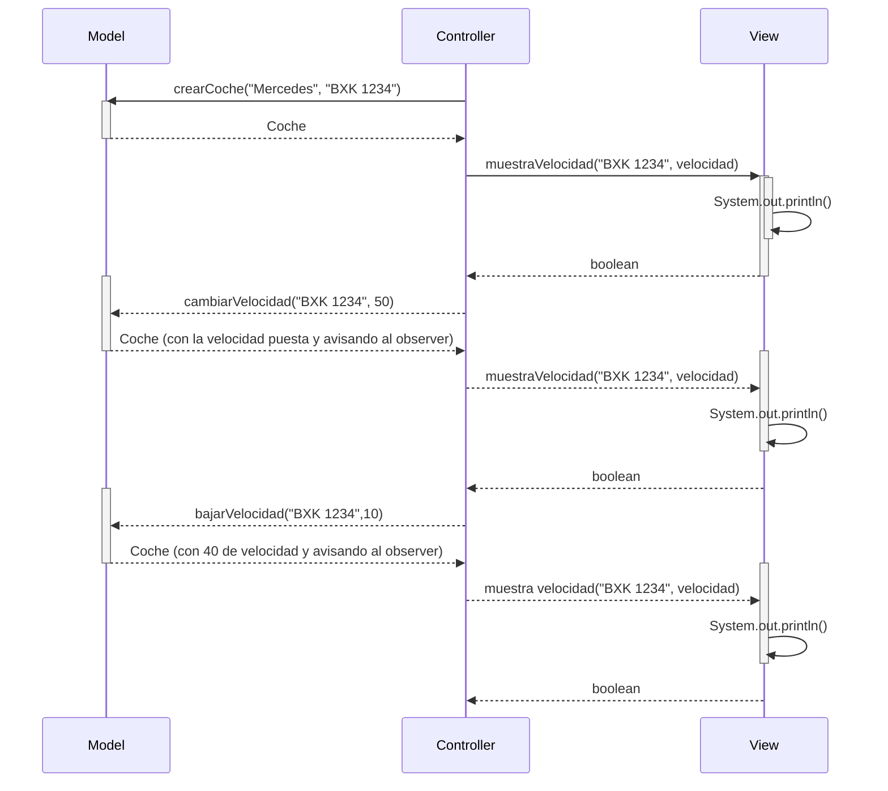

<h1>Examen Subir/Bajar Velocidad</h1>
<h5>Primera parte</h5>
Para la primera parte necesitaremos crear métodos para aumentar y disminuir la velocidad.
Para ello tendremos que:

1.  Crear la estructura de los métodos (va a necesitar 2 parámetros, la matrícula y la cantidad de velocidad que quieres disminuir)
2.  Obtener un coche a partir de su matrícula y de ahí pillar su velocidad
3.  Aumentar o disminuir (dependiendo del método que llames) la velocidad actual del coche 
4.  Notificar a los observadores al final de todo
5.  Crear un método para que pueda usar el controller los métodos que acabas de crear

<h5>Segunda parte</h5>
Con los métodos ya hechos tendremos que fabricar unos tests para poder probar los métodos que ya hiciste 
Después tendremos que:
1. Modificar el diagrama de secuencias para que se amolde a tu programa de tal forma que quede así (solo puse un método de los dos creados, pero el otro, en vez de bajar/restar velocidad, la añadía):



Diagrama de clases 
```
classDiagram
    class Coche {
        String: matricula
        String: modelo
        Integer: velocidad
    }
      class Controller{
          +main()
      }
      class View {+muestraVelocidad(String, Integer)}
      class Model {
          ArrayList~Coche~: parking
          +crearCoche(String, String, String)
          +getCoche(String)
          +cambiarVelocidad(String, Integer)
          +getVelocidad(String)
      }
    Controller "1" *-- "1" Model : association
    Controller "1" *-- "1" View : association
    Model "1" *-- "1..n" Coche : association
```

2. Después de modificar lo anterior y el diagrama de clases, tendrás que subir todo cerrando todos los issues que has abierto

